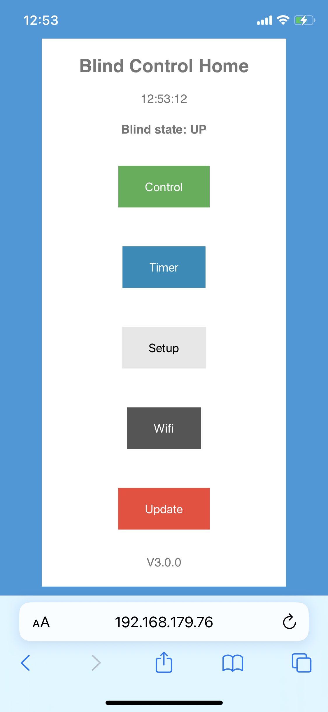
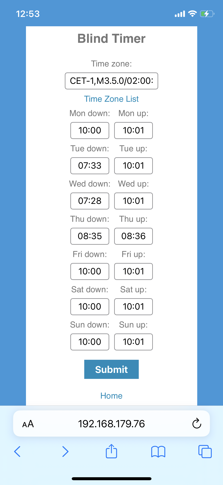
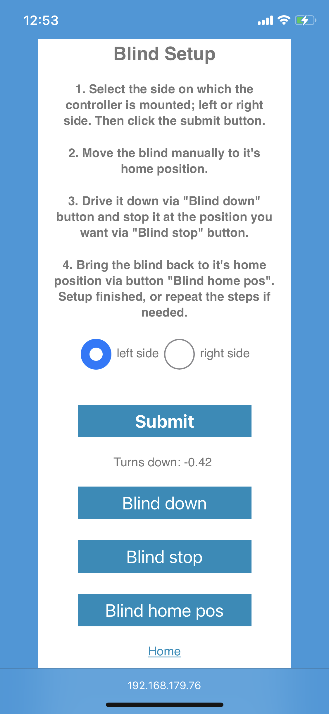
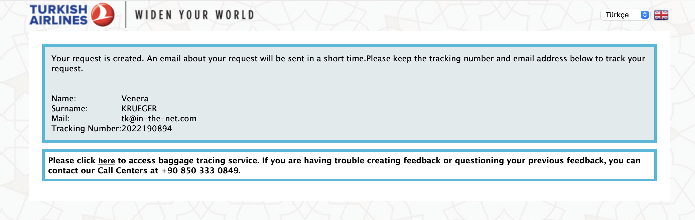
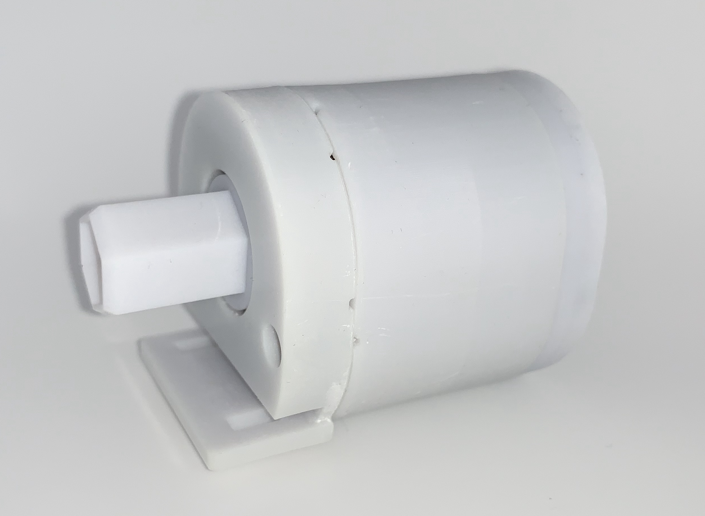
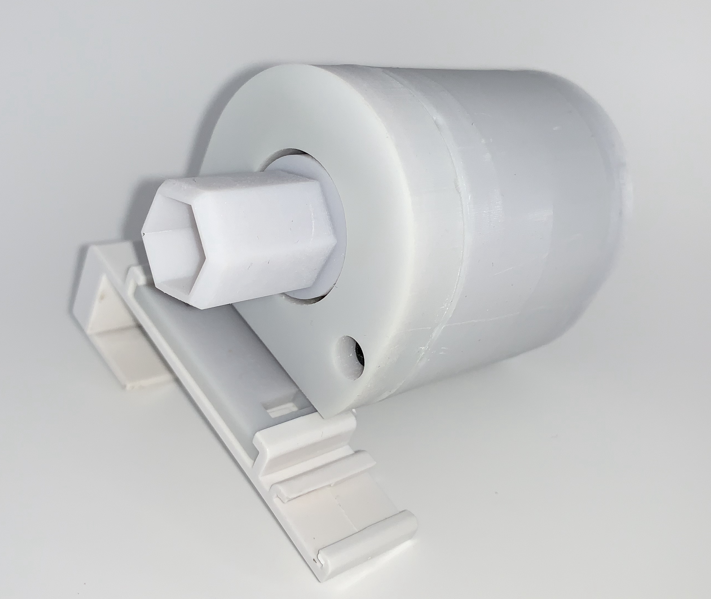
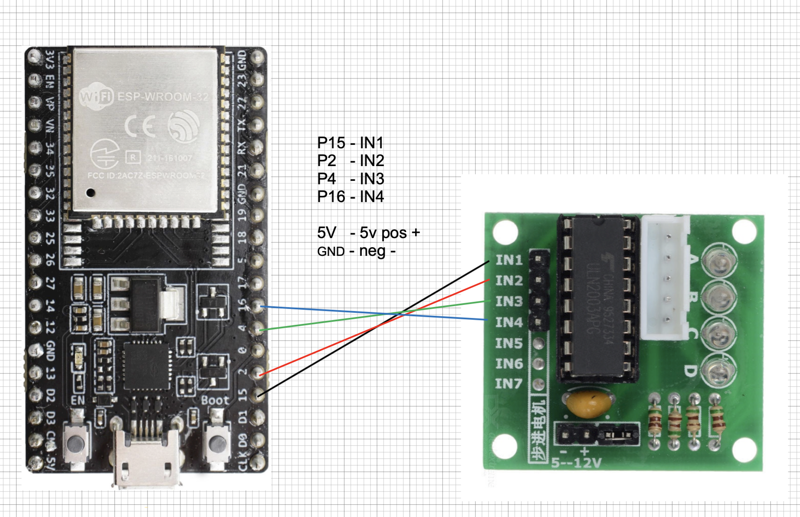

# Willkommen bei mysmartrollo - lass Dich von der Sonne wecken

Fast jeder hat Innenrollos in der Wohnung, Sichtschutzrollos, Verdunkelungsrollos, Doppelrollos... Standardmäßig wird so ein Rollo über eine Perlenkette runtergelassen und hochgezogen. Im täglichen Gebrauch ist es nervig, speziell wenn man lange 
Gardienen, ein Bett oder einen Tisch davor hat. Aus diesem Grund habe ich ein System erstellt, welches meine vorhanden einfachen Rollos automatisiert.

Das System ersetzt den Perlenkettenantrieb per Plug&Play mit dem neuen Antrieb. Die Installation dauert nur ca. 1 Minute. Die Einrichtung erfolgt komplett per Webbrowser und ist super einfach. Das Endgerät ist dabei egal, solange es eine Wlan 
Verbindung 
unterstützt, ein Smartphone ist dafür ideal. Nach Abschluss der Einrichtung können die Rollos per Klick am Smartphone, per Sprachsteuerung oder einfach zeitgesteuert runter und hoch gefahren werden.

## Software

<pre>&#9;&#9;&#9;</pre>

## Antrieb

<pre></pre>
<pre>&#9;&#9;</pre>

## Hauptmerkmale

- Intuitives Web Frontend
- System funktioniert ohne Internetverbindung, jedoch ist ein NTP Server für die korrekte Zeit nötig (z.B. FritzBox)
- Plug&Play Installation
- System ist 5 Volt basierend
- Micro USB Anschluss zur Stromversorgung
- Low Power Modus (ideal wenn der Antrieb mit Batterien genutzt wird)
- flüsterleise im Betrieb
- Links/Rechts Modus (Software Schalter)
- präzise Positionierung
- Standard Hardware
- Einfache Integration in Sprachassistenten

## Kommunikation

- Standard Wireless LAN auf Basis von 802.11
- Einfaches Wlan Setup via Web frontend (DHCP oder fixe IP)
- Internet unabhängig
- Nur eine NTP Server wird für Zeiteinstellung benötigt, das kann der lokale Router sein

## Funktionen

- Einfache Setup per Web Frontend für alle Funktionen
- Steuerung über jeden Browser, Endgeräteunabhängig
- Timer für tägliche Runter/Hoch Einstellung
- Schlaf Modus für Low Power Betrieb
- Updates per Web Frontend
- Factory reset per Web Frontend oder Hardware Taster

## Steuerung

- Via Ieb Interface
- Einfache Integration in Heimautomationsysteme (http links)
- Sprachassistenten wie z.B. Siri

## Extras

- Einfache Verwendung und Anpassung an jedes Innenrollo

## Was wird benötigt?

- Für jedes Rollo wird ein ESP-32 micro Kontroller benötigt, ein 28BYJ-48 5vdc Schrittmotor mit Kontroller, ein paar Dupond Kabel und ein 5v Steckernetzteil mit Micro USB Anschluss

- ESP-32: https://amzn.to/3uuozcW
- Schrittmotor mit Kontroller: https://amzn.to/3FgGmcW
- OPTIONAL - Mini Schrittmotorkontroller: https://amzn.to/3Bu9mfZ
- Ein 5v Steckernetzteil mit Micro USB Anschluss

## Verbindungsschematik

Das folgende Bild zeigt schematisch die Verbindung zwischen ESP-32 und Schrittmotorkontroller

<pre></pre>

## Installation und Start

[Installation guide](https://github.com/danieldownload/mysmartrollo/wiki/Installation-guide)

## Spende
Wenn Du mich unterstützen möchtest, dann gib mir einen Kaffee aus :) [Paypal](https://www.paypal.com/donate/?hosted_button_id=XN85B8YSH7KBL)
