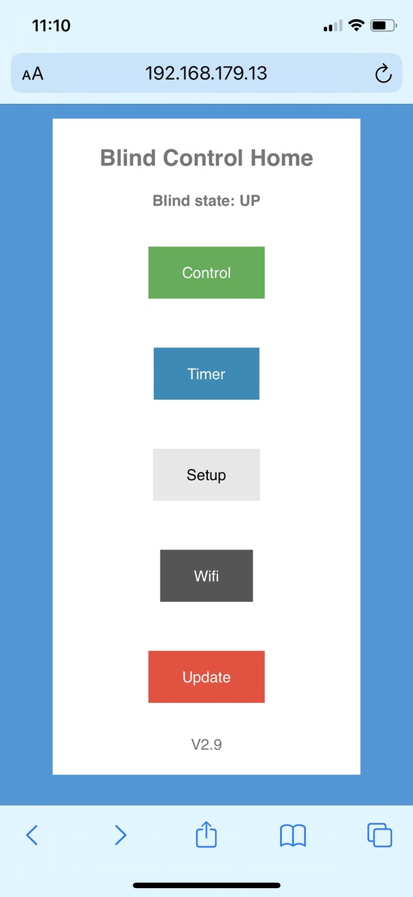
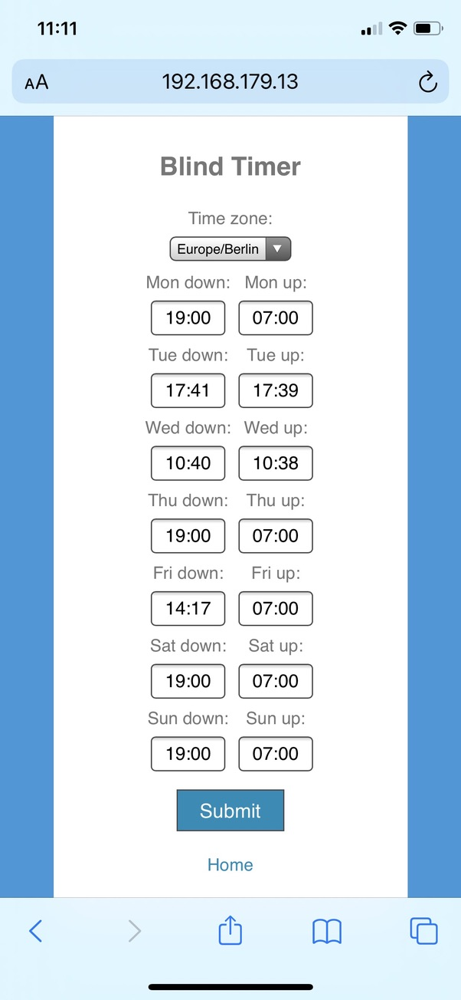
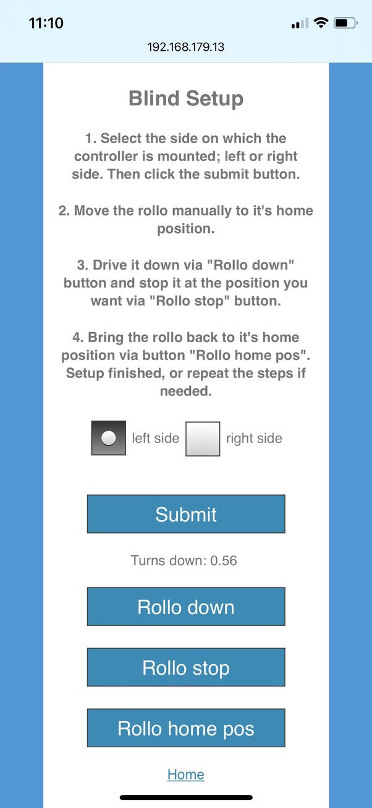

# Welcome to mysmartrollo - let the sun wake you up

Almost everyone is using window blinds / rollos at the insides of windows. The default method to move blinds like that up and down is via a pearl chain. That can be annoying in everyday use, especially if there are curtains, beds or tables close to the window. I created a system, which can automate your blinds or rollos, easy manually control is of course possible as well.

The system is a plug&play replacement for the existing pearl chain drive. Installation takes just a minute, configuration is super easy via Web browser. The wireless connection is standard wifi and IP based, thus one can use any end device like smartphone, PC... After installation and configuration one can use a klick in any browser, any voice assistent like Siri or daily time based setting to move the blinds up or down.

While running, the system is virtually silent.

## Software images

<pre>&#9;&#9;&#9;&#9;</pre>

## Device images

<pre></pre>
